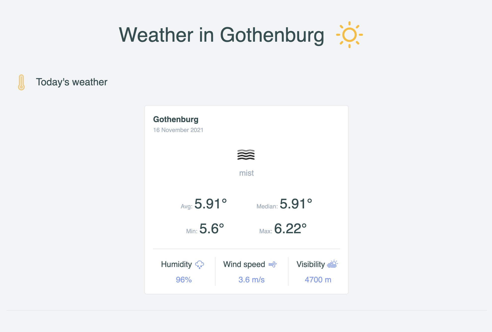

# Simple react app using Open Weather API

Weather data for Gothenburg fort the latest 4 days is shown. Max, min, median and average temperature are calculated based on the values from hourly weather data

Done using Vitejs starter using React, Typescript and Jest.

## Running the program

- Create an API key on [Openweather](https://openweathermap.org/)
- create an `.env` file on root dir with value of `VITE_WEATHER_APP_KEY=your_key`
- install dependencies by running `yarn`
- start local app by running `yarn dev`
- start tests by running `yarn test`

